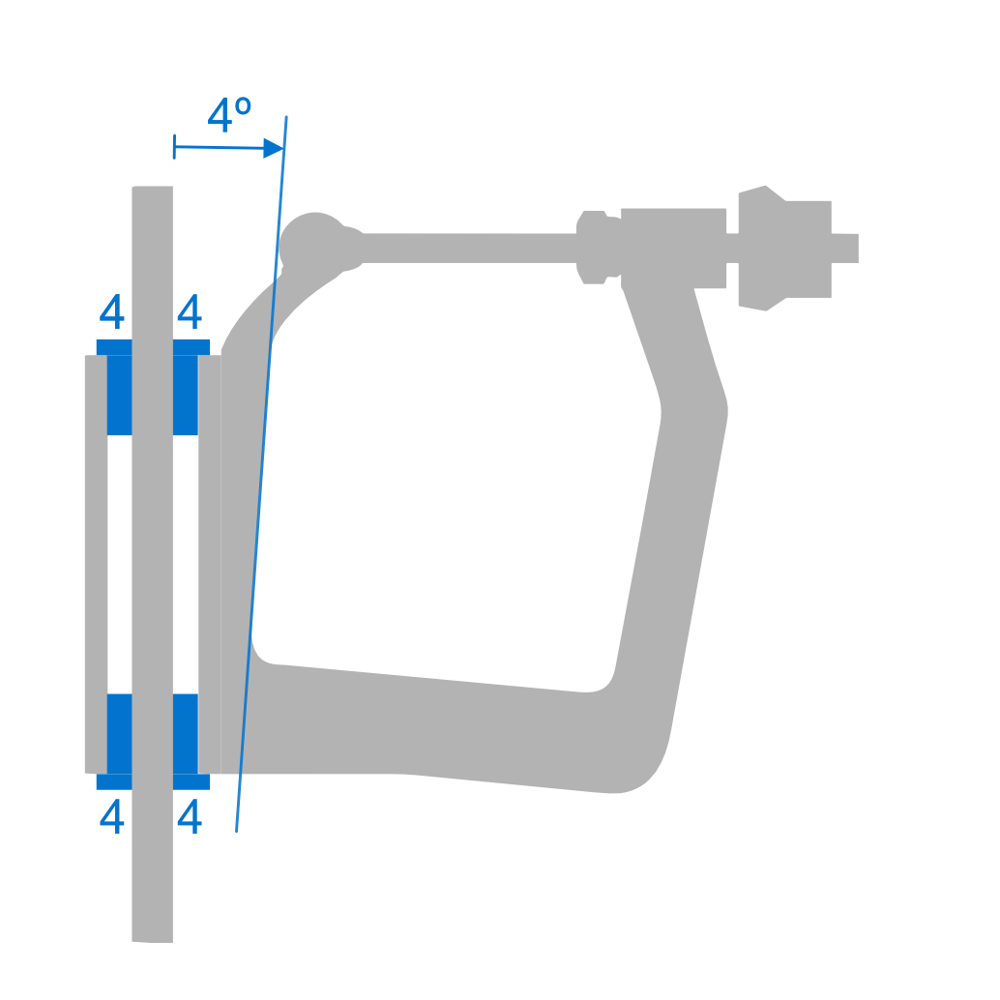
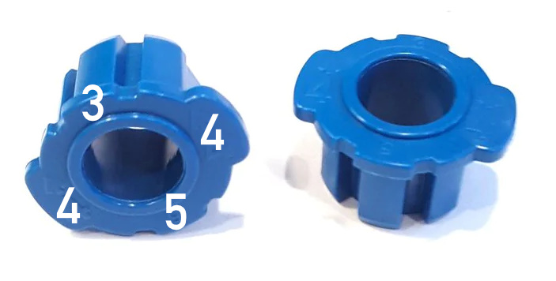
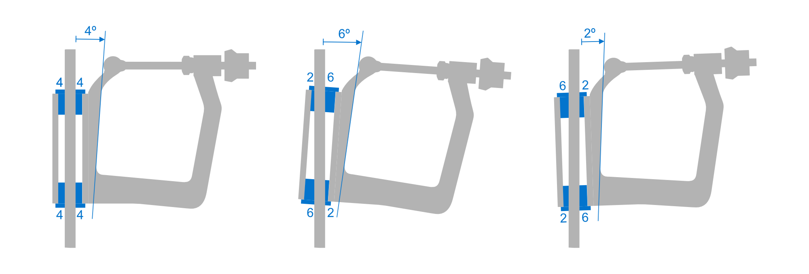

# Adjusting Oar Lock Pitch

A [Concept2] oarlock has a built-in pitch: the face against which the
sleeve of the oat shaft is resting during the drive is pitched by 4
degrees. This assumes the oarlock pin is vertical.

This pitch can be adjusted using the blue bushings that connect the oarlock
with the metal pin. Bushings come in variants and are labeled
with numbers that are opposite each other: 4/4, 5/3, or 6/2.

* By default, 4/4 is used and it results in the standard 4 degree pitch:
  the oar lock on the left in the picture above.

* To increase the pitch to 6 degrees, one would use bushings that are
  labeled 6/2 and insert them such that the 6 on the top is adjacent to
  the gate and the bottom the other way round. This tilts the
  entire oarlock mechanism such that pitch is now 6 degrees.

* Conversely, to reduce pitch to 2 degrees. The same bushings would be
  used but inserted 180 degrees rotated. Now 2 is adjacent to the gate.
  Again, the oarlock is tilted such that the resulting pitch is 2
  degrees.

* Smaller changes are possible. The 4/4 bushings in the picture above can be
  also used to create 5 and 1 degree pitch.

[Concept2]: https://www.concept2.com/service/oars/pitch/adjusting-pitch-with-bushings
