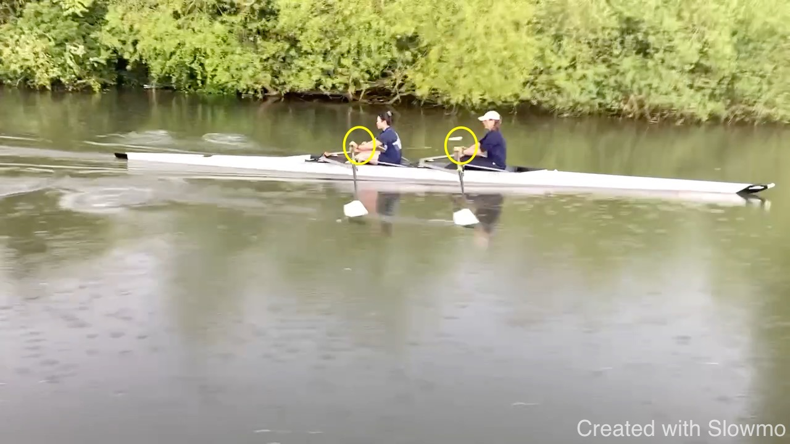
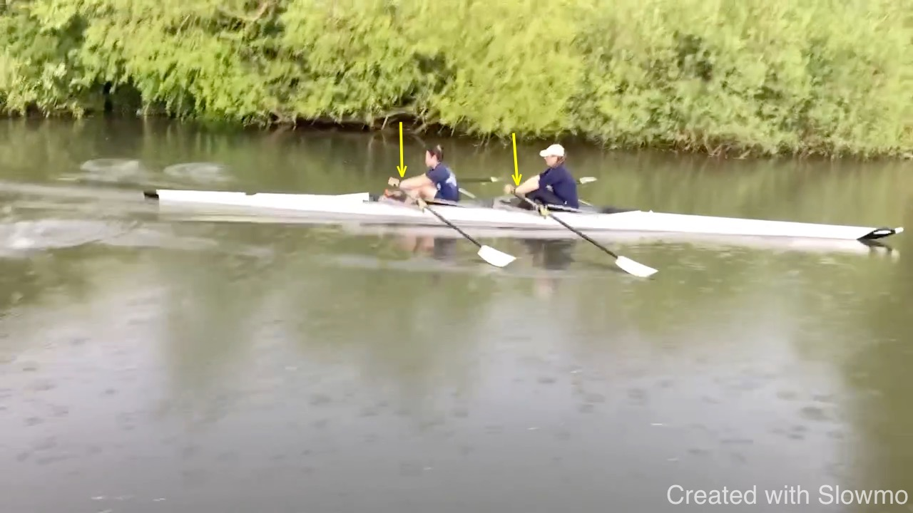
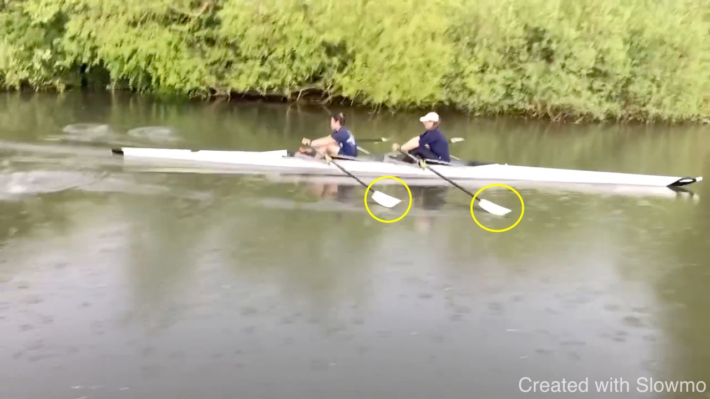
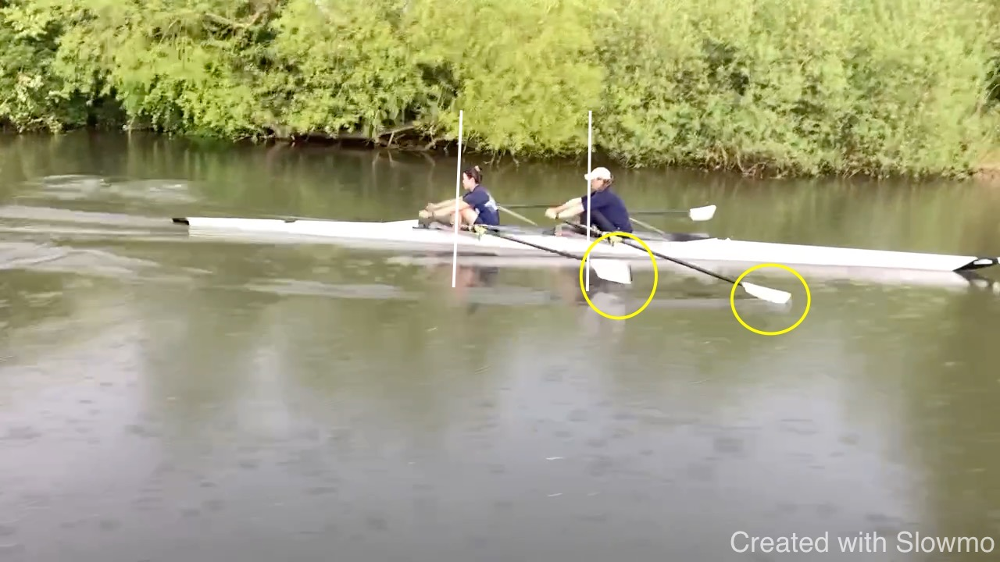
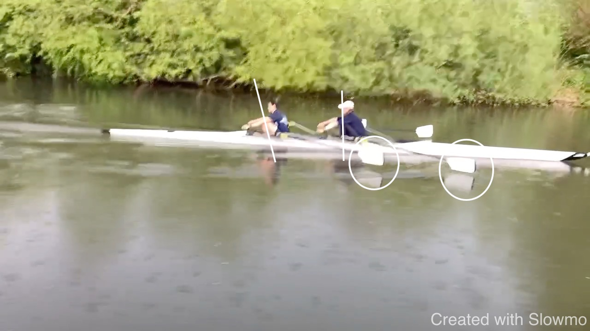
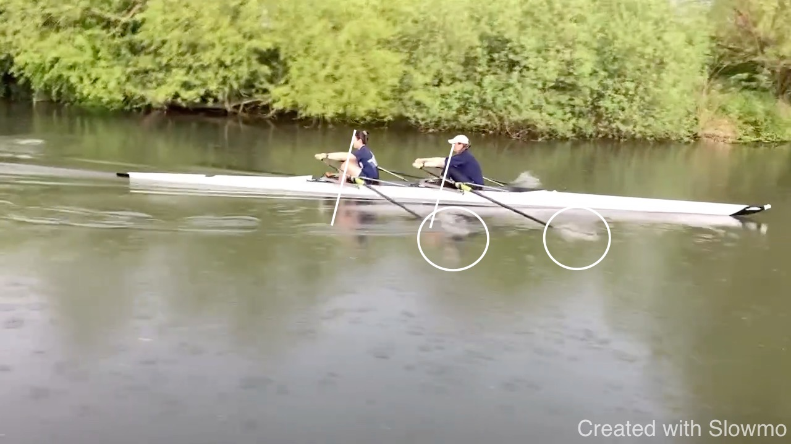

# CAB XPR 2x 2023-05-05

Video from the session on Friday

<iframe width="560" height="315" src="https://www.youtube.com/embed/FR0YQynqARA" title="YouTube video player" frameborder="0" allow="accelerometer; autoplay; clipboard-write; encrypted-media; gyroscope; picture-in-picture; web-share" allowfullscreen></iframe>

Below are some observations and I invite your comments on them. We talked
about separation of out the finish: getting the hands out (closer to the
catch to find time early) before rocking. During this time the boat will
run and do some work for us.

I notice that getting the arms straight and ready is compromised by
hands behind the handle. So a more relaxed wrist would help; obviously
some wrist action is required but we want to keep it small. 

As an example, watch this crew (which inspired my "Croatian Pauses"
exercise):

<iframe width="560" height="315" src="https://www.youtube.com/embed/5EX2XJYPsK8" title="YouTube video player" frameborder="0" allow="accelerometer; autoplay; clipboard-write; encrypted-media; gyroscope; picture-in-picture; web-share" allowfullscreen></iframe>

Or this crew:

<iframe width="560" height="315" src="https://www.youtube.com/embed/11YH_7Esfjc?start=100" title="YouTube video player" frameborder="0" allow="accelerometer; autoplay; clipboard-write; encrypted-media; gyroscope; picture-in-picture; web-share" allowfullscreen></iframe>

Notice where both crews are catching: with shins vertical, with the
knees at the highest point. The most important part is that the catch
happens when seat is turning around - so when there is no more seat
movement. But by compressing beyond shins vertical is is more likely
that the seat has stopped before the catch happens. The extra length
gained is paid for by having the boat slowed down.

Below are 4 moments:

* approaching the catch
* shins vertical
* catch (shins beyond vertical)
* connection

When the shins are vertical the blades are not ready (enough) and I
believe the catch could be improved. How?

* Flatter wrists such that we can get the hands out more earlier because
  arms can be straightened
* This also forces to square earlier
* Not looking for length by compressing beyond vertical shins or
  reducing this
* Instead, opening wider, more moving between handles.

The last point corresponds with "keeping the handles out" in the early
drive: we don't pull on them - but drive the boat, letting the handles
come to us.

