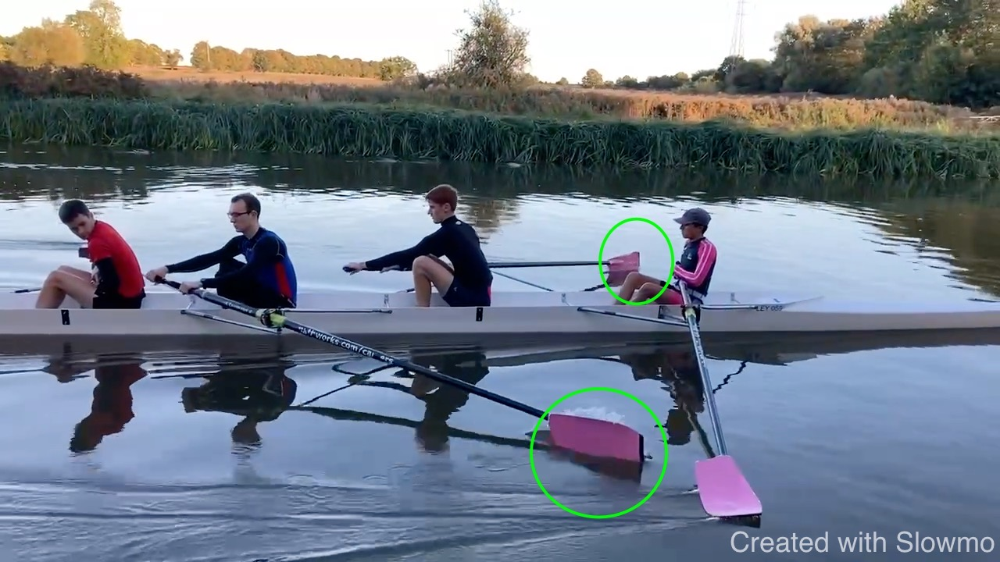

# CHU 4+ 2023-10-15

Some observations from the outing and frames from the GB 4- for
comparison.

<iframe width="560" height="315" src="https://www.youtube.com/embed/f-1jsuvYDiY?si=VuFgTtBL1YEDL-5H" title="YouTube video player" frameborder="0" allow="accelerometer; autoplay; clipboard-write; encrypted-media; gyroscope; picture-in-picture; web-share" allowfullscreen></iframe>

## Posture at the Front

I think Dan is overreaching; we want to be tall at the front and can
reach only so far that we don't lean onto the handle for stability. If
we lean onto the handle, the body will open once the load comes on to
re-gain stability and this gets into the way of executing a leg drive
where the body is stable.

## Posture at the Finish

Charles could look for more upright stability; part of getting behidn
the handle is coming from the feathering motion of the outside hand. We
want to rotate the outside hand in the horizontal plance: knuckles stay
perpendicular to the boat and not rotating around the axis of the shaft.

We want the outside elbow to not drop below the outside hand. This
means, the elbow is away from the body (not necessariy high).

## Drive Sequnce

Johnny keeps the body angle until half slide. This is by "keeping the
handle out" not pulling on it but by pushing the boat instead.

There are some difference to Jon. Differences in height are surely
contributing here.

Comparisons are not entirely fair here because of the differences in
size. But Charles could press-and-hang a bit more.

## Catch Timing

When the knees are at the highest point, the blade touches the water.
Here Jon and Johnny:

John is here not fully connected before applying power. 

## Staying Central

Observe that the crew stays fairly central. The inside knees goes to the
sternum.

