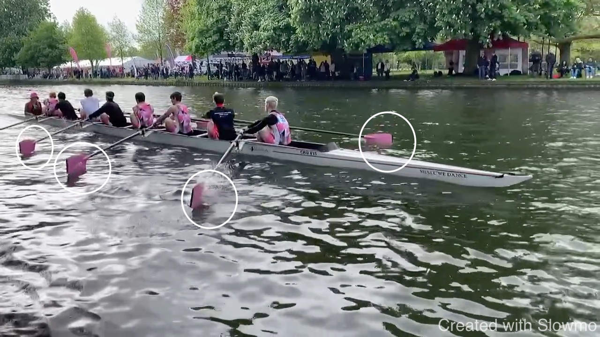
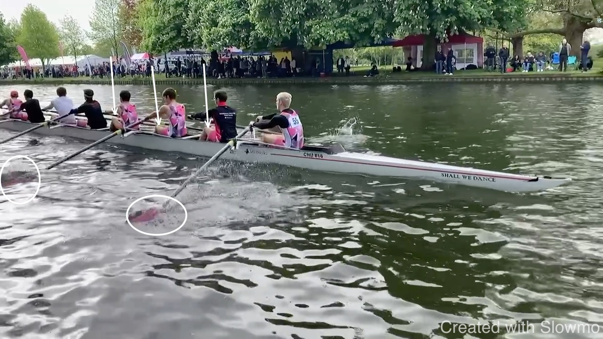
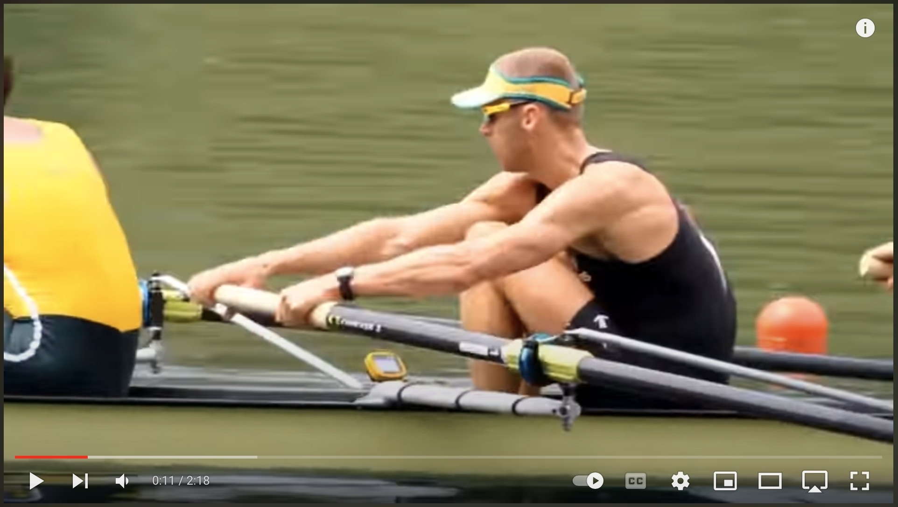
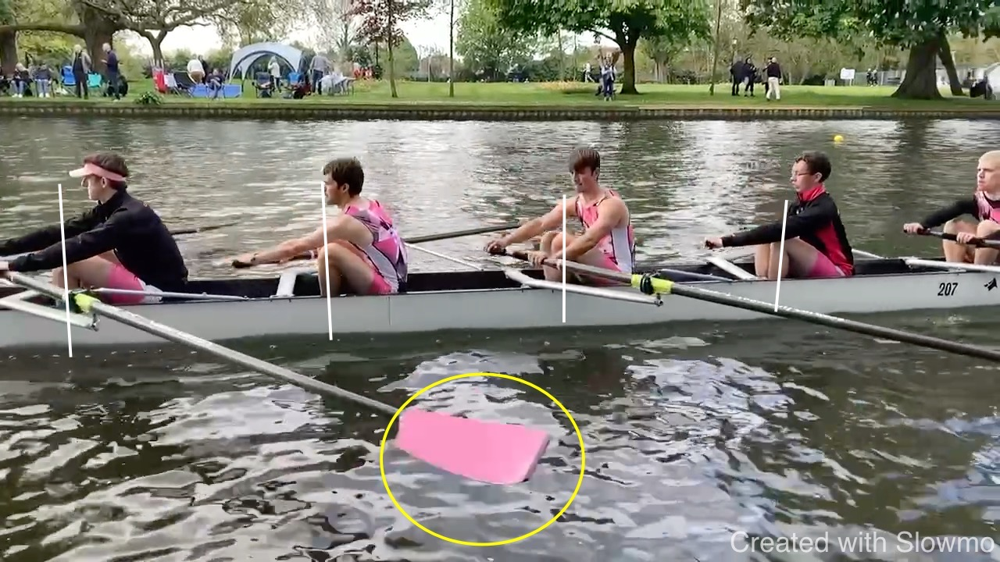
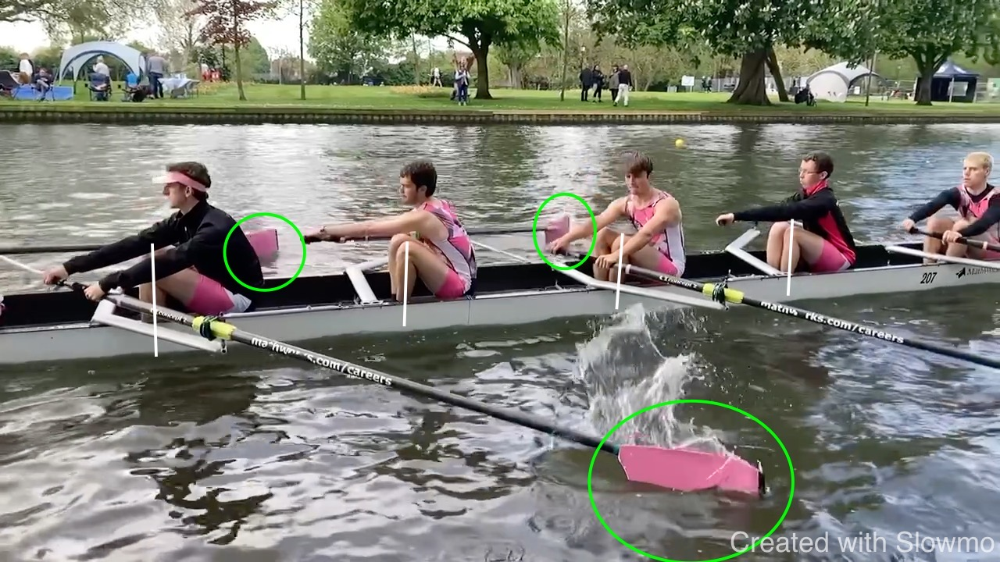
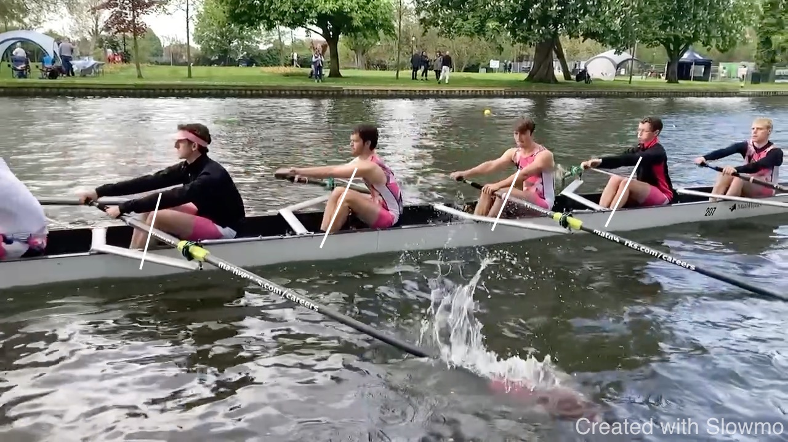
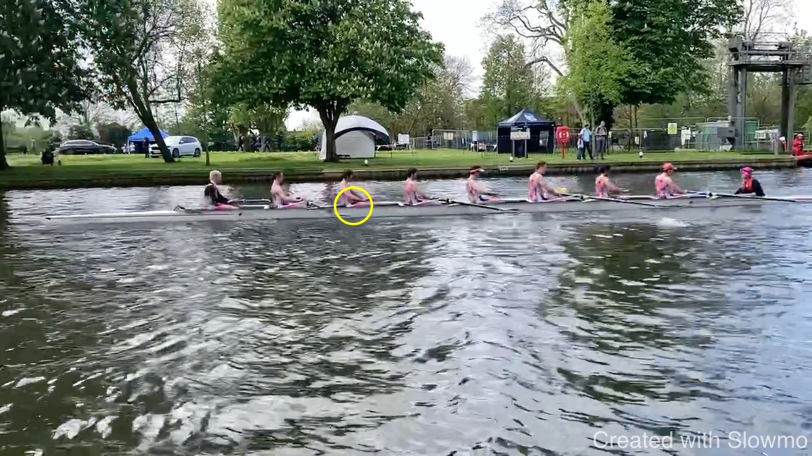
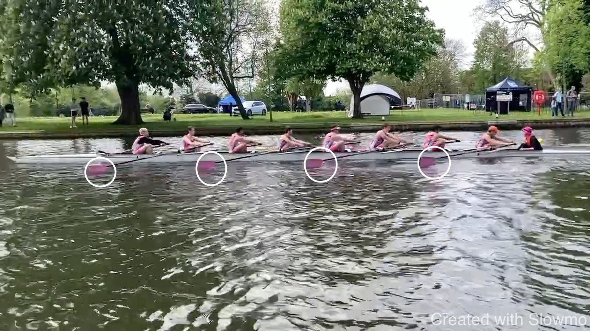
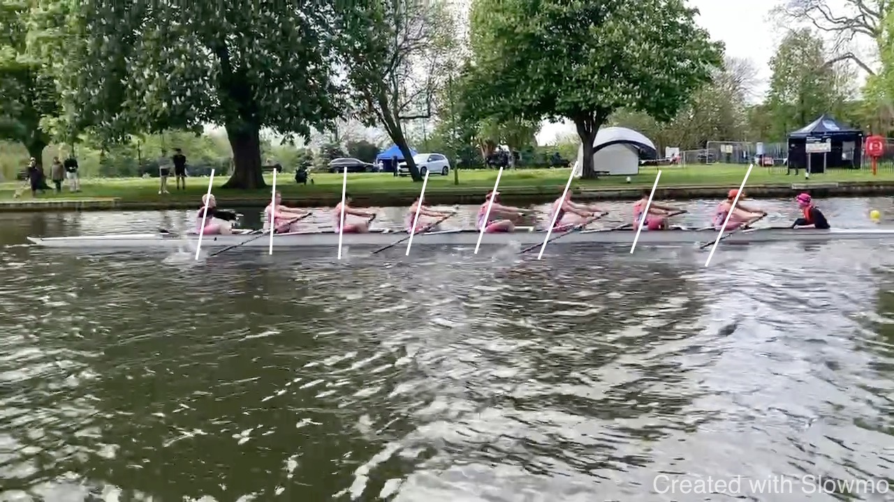

# CHU M1 at Bedford

<iframe width="560" height="315" src="https://www.youtube.com/embed/rqLk96gs98Y" title="YouTube video player" frameborder="0" allow="accelerometer; autoplay; clipboard-write; encrypted-media; gyroscope; picture-in-picture; web-share" allowfullscreen></iframe>

## Results

* [Bedford Regatta](https://rowstats.com/regatta.php?id=23095&b=1)

|No |Time and Category |   | Crew                              |   |  Crew                                      |Time|Result               |
|---|------------------|---|-----------------------------------|---|--------------------------------------------|----|---------------------|
|34 |09:52  COL.B.8+   |GTM| (54) Green Templeton BC (Arroway) |CHU| (55) Churchill College                     |3:42| easily              |
|87 |12:15  COL.B.8+   |CHU| (55) Churchill College            |SEH| (56) St Edmund Hall                        |3:32| 1/4 length CHU lost |

## Connection

Some observations from the video above - I invite your comments. The
goal of the catch is to pick up the boat before it slows down too much.
The best moment is when the shins are vertical and the knees at the
highest point: the seat turn around, blades connect and pick up the
boat.

We can see that the blades touch the water at the right moment. Some
seats are over-compressing a bit. We can only drive the boat once the
blades are fully submerged. The second frame above shows that moment. We
can see from the positions of the knees that many seats are at half
slide at this moment. Hence, the early part of the stroke happened
without being connected.

This suggests that blade entry is a bit slow and requires more
relaxation but more importantly, the drive needs poise: patience for
the connection, for the blade to fill with water. Look at the crew below
and how they can move the boat because they utilize the full leg drive.
To get to that, think: place, gather, push. The quickness we are looking
for is not in the initiation of the drive but the absence of any
hesitation to enter the blade.

<iframe width="560" height="315" src="https://www.youtube.com/embed/Wff25wXWE9o" title="YouTube video player" frameborder="0" allow="accelerometer; autoplay; clipboard-write; encrypted-media; gyroscope; picture-in-picture; web-share" allowfullscreen></iframe>

Another element of getting a good catch is not looking for too much
length using over compression but being ready when the shins are vertical.
To be ready early we need the hand to lead to recovery and start sliding
only once arms are straight and the body rocked over - this way the
hand arrives together with the seat rather than the seat early (we stall
with the seat) while the hand is still moving.

For a good catch angle it is more effective to use rotation rather than
linear length and compression. This goes hand in hand with the drive
where we "keep the handle out": not pulling on the handle but pushing
the boat, hanging from the handle.

# Rock Over

Below I am looking at the rock over. It has to come from the hips and
pelvis and not just the upper body. It's easy to see with the kit how
the hip is angled. When the pelvis is angled backwards, everything is
just more complicated.

