## The Stroke of Drew Ginn

<iframe width="560" height="315" src="https://www.youtube.com/embed/BfpL_Ll9AjE?si=NV40hu5Tl4Onmh8r" title="YouTube video player" frameborder="0" allow="accelerometer; autoplay; clipboard-write; encrypted-media; gyroscope; picture-in-picture; web-share" allowfullscreen></iframe>

I encourage to take a look at the stroke of 
[Drew Ginn](https://en.wikipedia.org/wiki/Drew_Ginn)
in the video above and to understand what he is doing. Below are frames
from the video - starting from the finish:

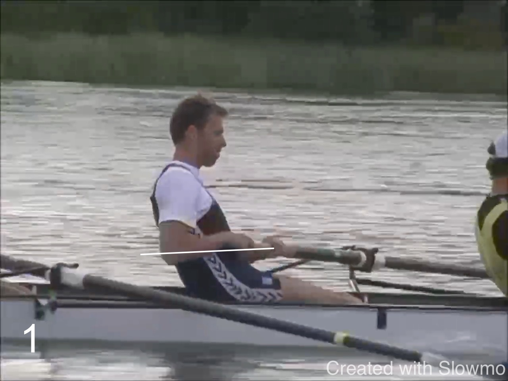
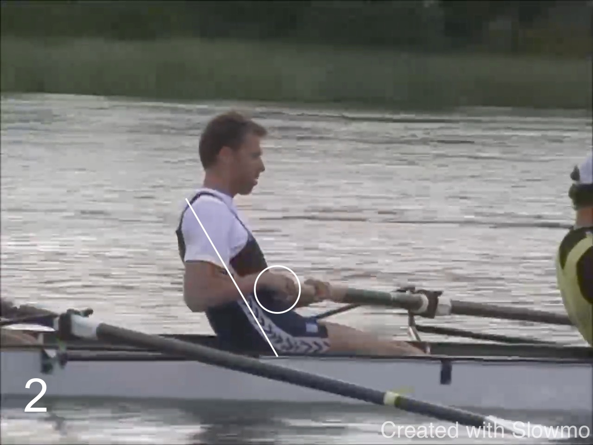

* At the finish, the outside elbow is about level with the hand. It's
  not obvious from the frame, but that requires the elbow to be away
from the body such that the lower arm is almost an extension of the
handle. The grip of the outside hand is loose. The handle was drawn
close to the body.

* As the outside hands moves away, it flows along the body: first down
  then away. The body stays *still* at the same angle.

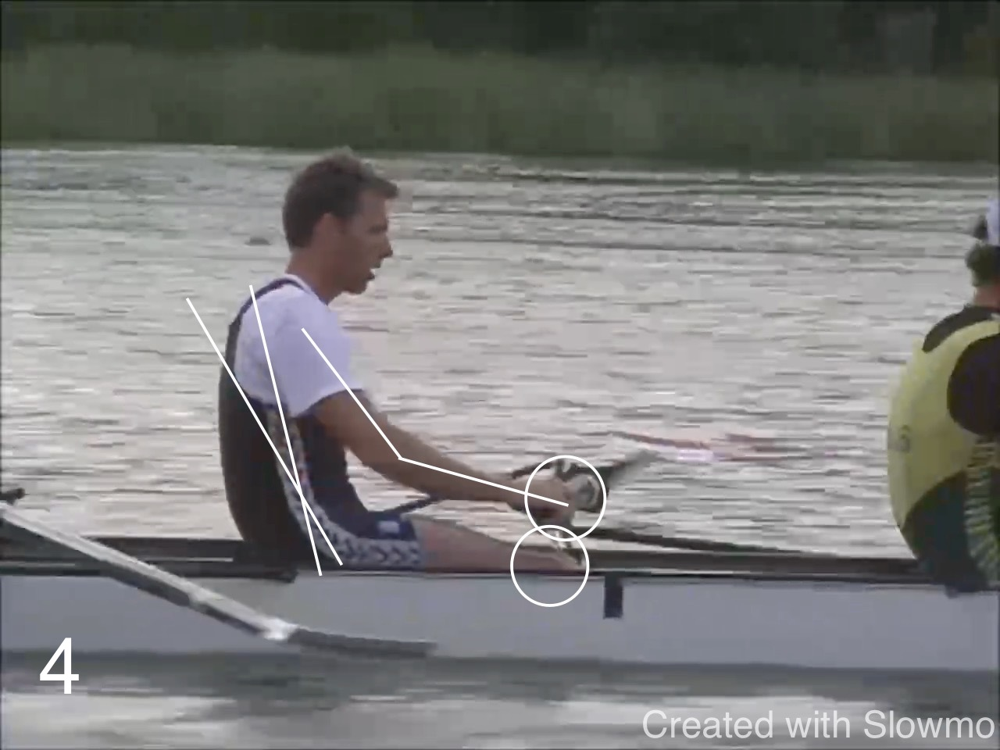

* As the arm extends further, it draws along the shoulders. Knees are
  still down and the slide has not yet started. None of this is rigid.

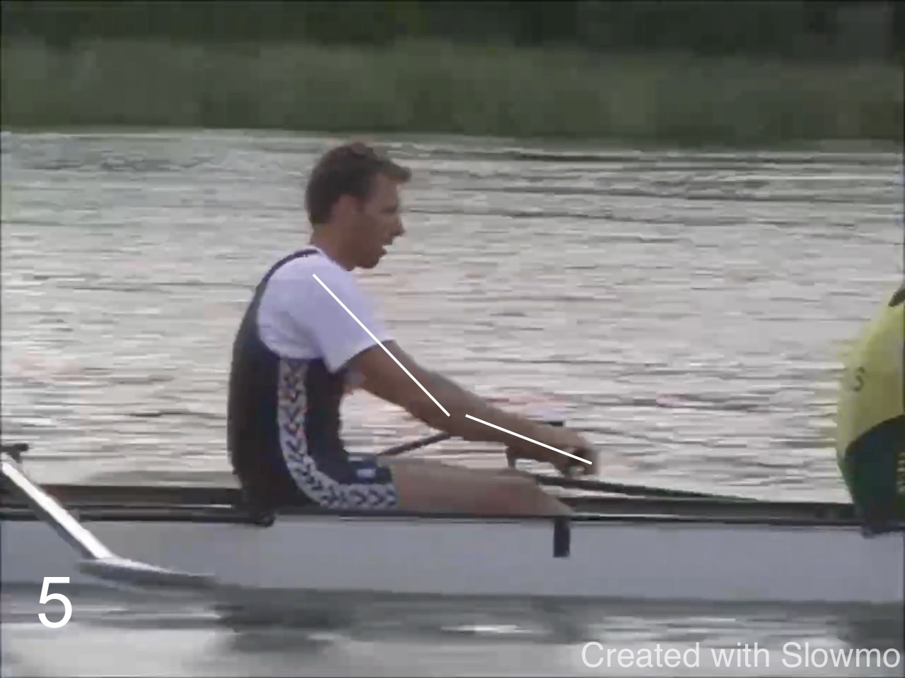

* As the knees soften, the arm is almost straight - it leads the
  recovery.

* The speed of the hand can be tought of in a different way: from the
finish, the boat and the rower moves on towards the finish line, and the
handle stays behind.

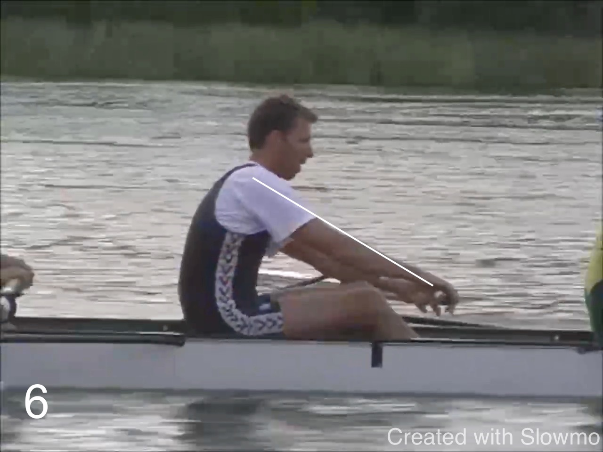

* Long before half slide the arm is fully extended. Now drawing the body
and the seat.
* Notice how relaxed hands and wrists are.

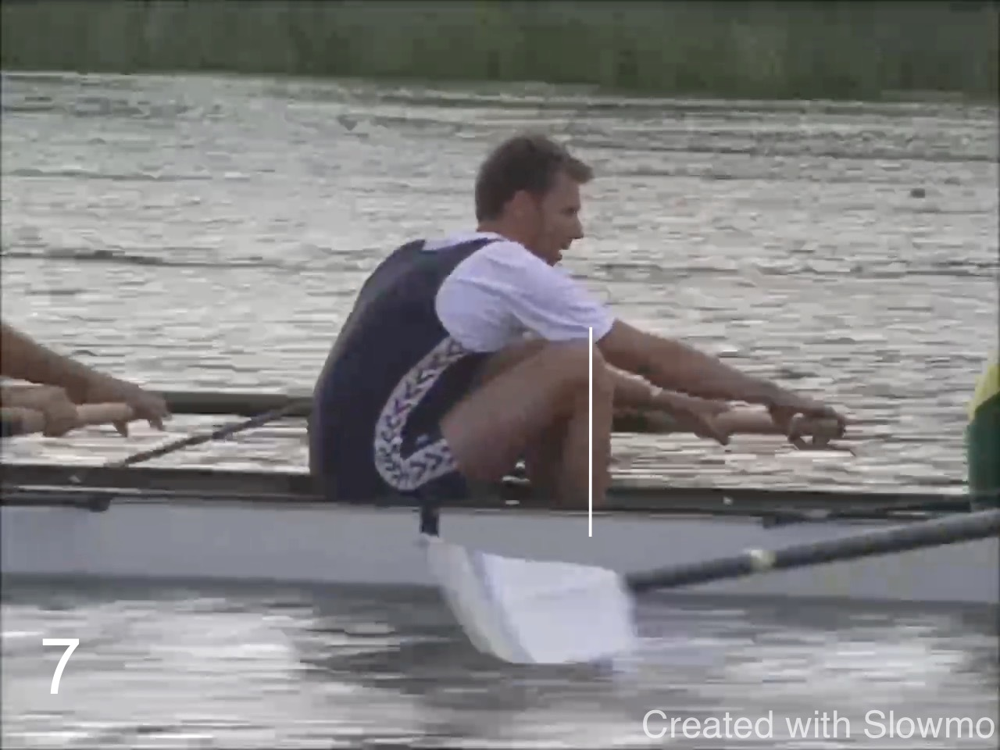

* Drew is rigged with the feet towards the bow. He compresses beyond
  vertical shins for the catch (I would not coach that). We can see the
black fitting for the rigger which also indicates the position of the
pin on the other side. Typically the hip is the pin for that catch. So
we can see that this is not yet reached in the frame above.

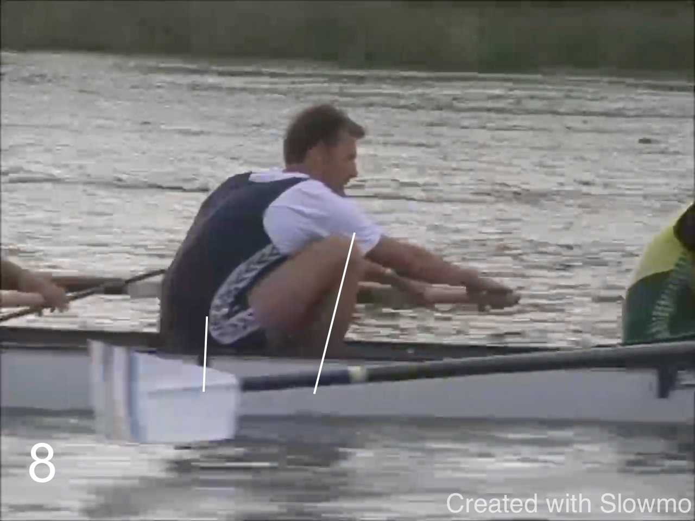

* The catch is reached. The hip is at the pin.

* Early in the drive the hip is moving away from the pin - but the back
  is stable.

* Hanging with relaxed arms. The lats are engaged and prevent the
  shoulder from rising to the ears.

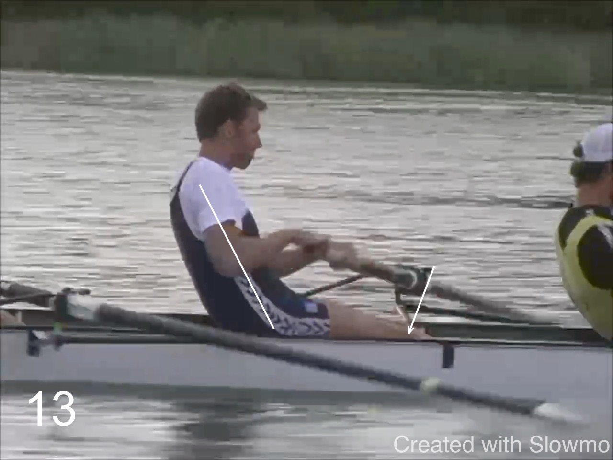

* Legs and body finish together. As the knees come down, the back
  movement stops. The hand has not yet reached the body.

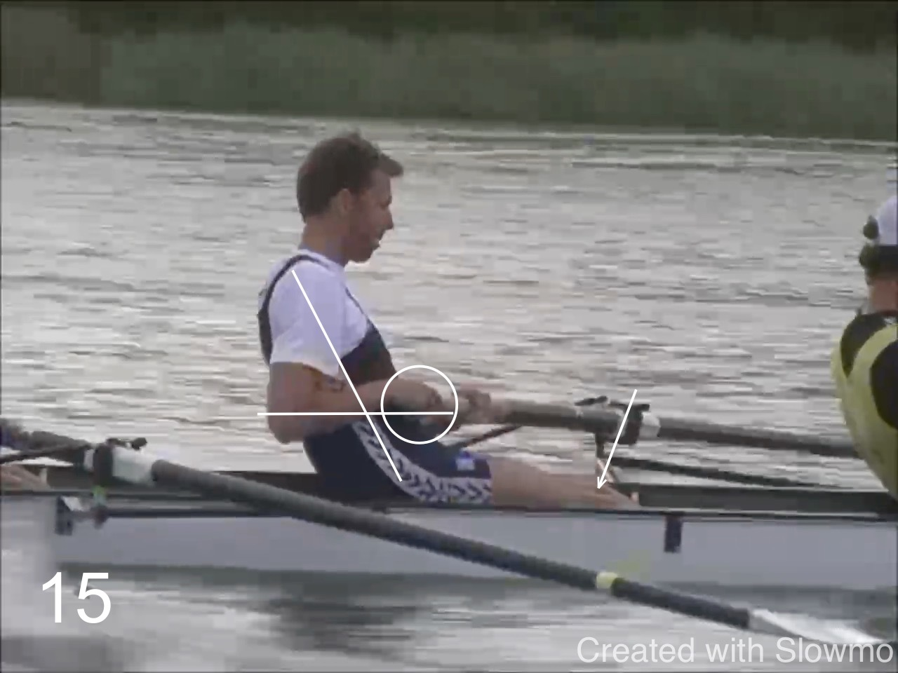

* The hand moves into a still body. We we are back where we started.

* It's not visible: the power has shifted to the inside arm and hand.
  This is how the outside hand can stay relaxed.

# Nines

<iframe width="560" height="315" src="https://www.youtube.com/embed/SnobFBR9Cgw?si=VM2_tZbhKzcEX8TZ" title="YouTube video player" frameborder="0" allow="accelerometer; autoplay; clipboard-write; encrypted-media; gyroscope; picture-in-picture; web-share" allowfullscreen></iframe>

Now let's look at the stroke of Nines

* The posture at the finish is quite different from Drew Gin's: there is
  more lean back and the outside elbow is below the handle. 

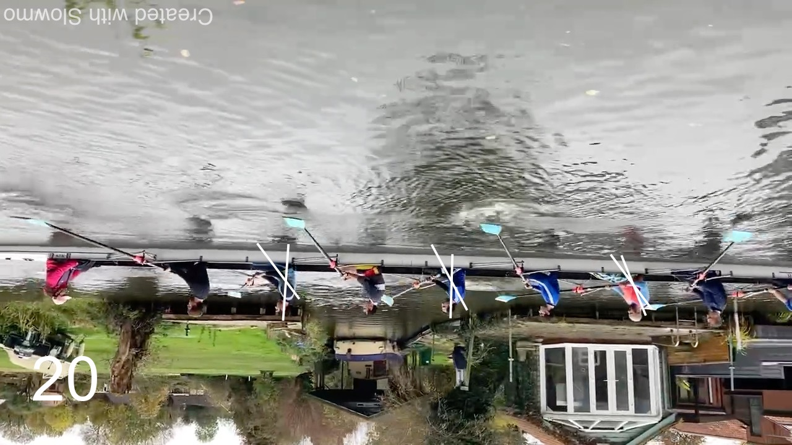

* The biggest difference is now: the body is moving out of the finish
  together with moving the hands. There is not the same stillness at the
  finish. (In my opinion this is more difficult to coordinate in a crew.)
  

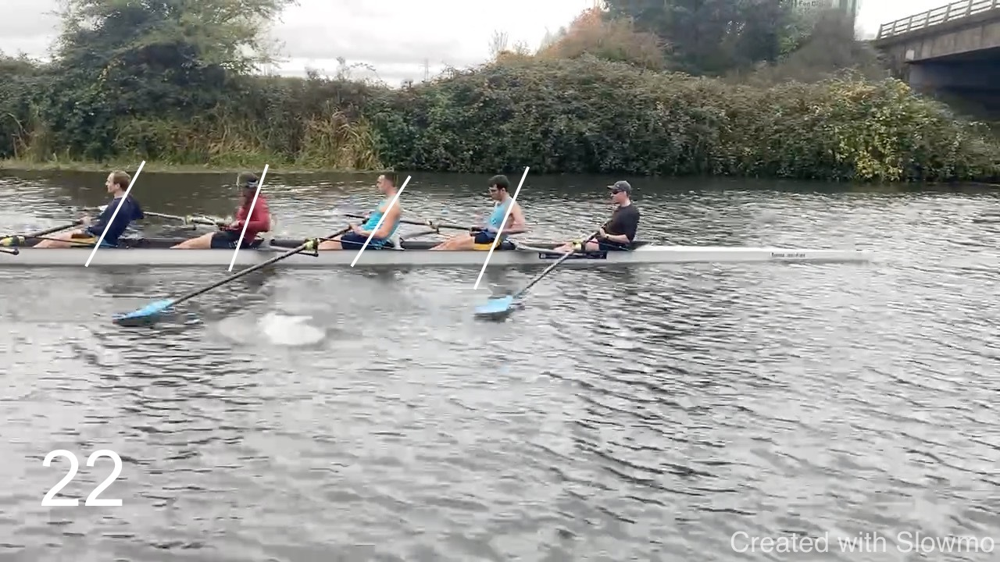

* The same is happening in the other boat - to a lesser extent.

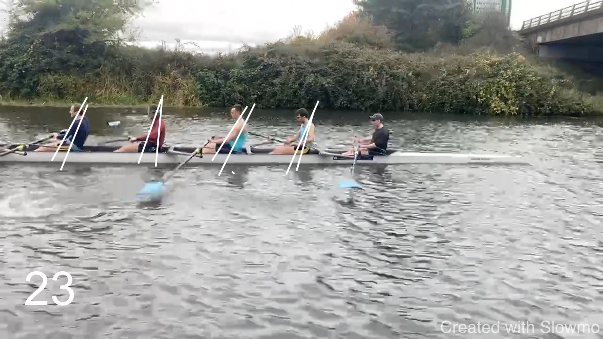

# Harry Mahon

Watch this Harry Mahon crew (and his explanations) to have a simiar
stroke. It is probably even more relaxed. Mahon's crews never looked
like they did any work.

<iframe width="560" height="315" src="https://www.youtube.com/embed/ZAOxPgeksaI?si=DgJ_8hsDAeFsY1Sr&amp;start=976" title="YouTube video player" frameborder="0" allow="accelerometer; autoplay; clipboard-write; encrypted-media; gyroscope; picture-in-picture; web-share" allowfullscreen></iframe>

# Australian Men

A detailed look at this men's crew with comments from their coach.
Again, many similarities but quite a bit less relaxed with a forced
finish.

<iframe width="560" height="315" src="https://www.youtube.com/embed/KEuD3CGdv0k?si=DhORIjWF58A4r5F_&amp;start=1818" title="YouTube video player" frameborder="0" allow="accelerometer; autoplay; clipboard-write; encrypted-media; gyroscope; picture-in-picture; web-share" allowfullscreen></iframe>
