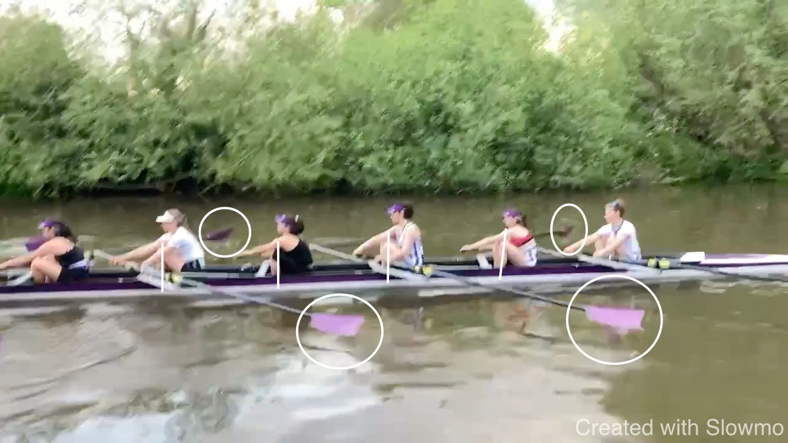

# Kings W1 2023-0

Some random thoughts and observations.

<iframe width="560" height="315" src="https://www.youtube.com/embed/FAbmCqeTAFA" title="YouTube video player" frameborder="0" allow="accelerometer; autoplay; clipboard-write; encrypted-media; gyroscope; picture-in-picture; web-share" allowfullscreen></iframe>

## Start

* Not everoyone is in the same position. If you start from 3/4 slide a
  good call for the cox is to "come forward" such that the outside hand
  is over the cente line of the boat.

* Stroke is ripping thorugh the water and finishes first. Any ripping
  causes problems because it immediately destroys the timing for the
  next stroke. It is important to not rip the water and to properly
  finish the stroke - in order to move the boat. See also seat 2, 3.

## Squaring

The crew is rowing a direct approach into the front. This requires a
precise catch - earlier squaring would help. When shins approaching
vertical, blades have to be square at the latest but are not.

## Shoulders

We worked on keeping the work low in the boat and in the body: "keeping
the handle out" and pushing the boat while shoulders and body are still
in the early part of the drive. This mostly works well; seats 4, 6, bow
could look for this in particular. I would be helpful by experienced
rowers to demonstrate how to engage the lats, which will keep shoulders
low. I talked about keeping the elbow more next and in front to the body
than behind - this enganges the lats and keeps the shoulders down.

## Hang in the Drive

I found this unversally good and suspect the crew worked on this:
keeping the arm in the drive relaxed, hanging from it. This avoid
working strong muscles from the legs working against the small muscles
of the arm. 

## Separation and Rock-Over

It is important to rocker over from the hips and not just the shoulders.
If we just bring the shoulders forward we will find it very difficult to
gain length.  We should not see the knees come up before the shoulders
are in front of the hips. I coach that the hands lead the recovery:
hands lead, body follows, legs follow. Time is found by leading with the
hands and letting the seat follow - rather the other way round. The hand
gets closer to the catch and hands and seat arrive together. Beginner
crews arrive with the seat first and struggle with the catch. 

## Posture at the Finish

I see quite some lean back at the finish in some seats and I question
that it is effective. Indeed, I believe it contributes to difficulties
with rocking over because it creates a long way for the body. A good way
to find out is rowing with feet out.

I am coaching that we are looking for stillness at the finish: legs and
body finish together, the hand moves towards the body. We tap down when
we no longer have pressure on the feet. If we are still, with the lower
arm an extension of the handle (rather than perpendicular to it), elbow
next to the body, we have the room and time to tap out, release the boat
from the blades, letting it run - with time to separate out.

## Recovery and Catch

This is an area where individual preferenes and style have the most
room. The crew has a fast and direct appraoch into the front - stroke
seat in particular. This is to a degree that the crew does not follow
stroke one hundret percent - observe timing difference between 5 and 7
in the recovery (not the catch) - and I believe 7 is in a difficult
position to follow stroke but also feeling that the crew is not doing
this exactly. I would think about a more controlled approach into the
catch that avoids over-reach. 

