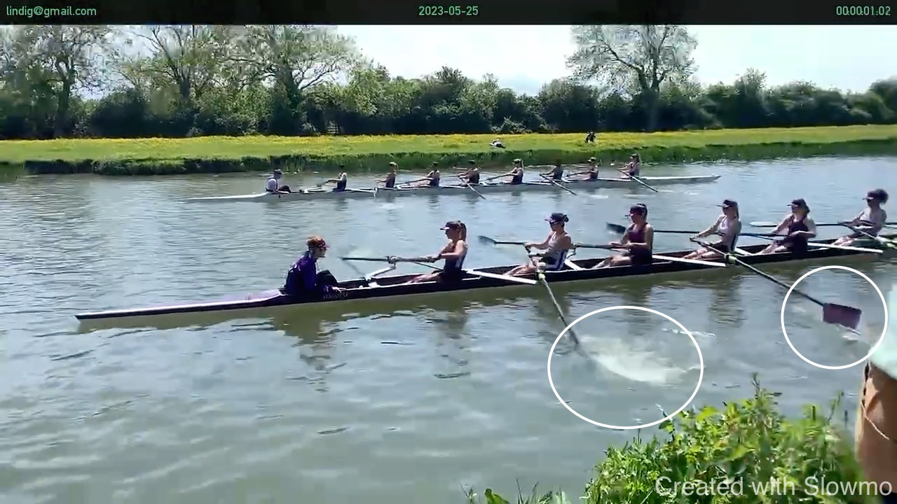
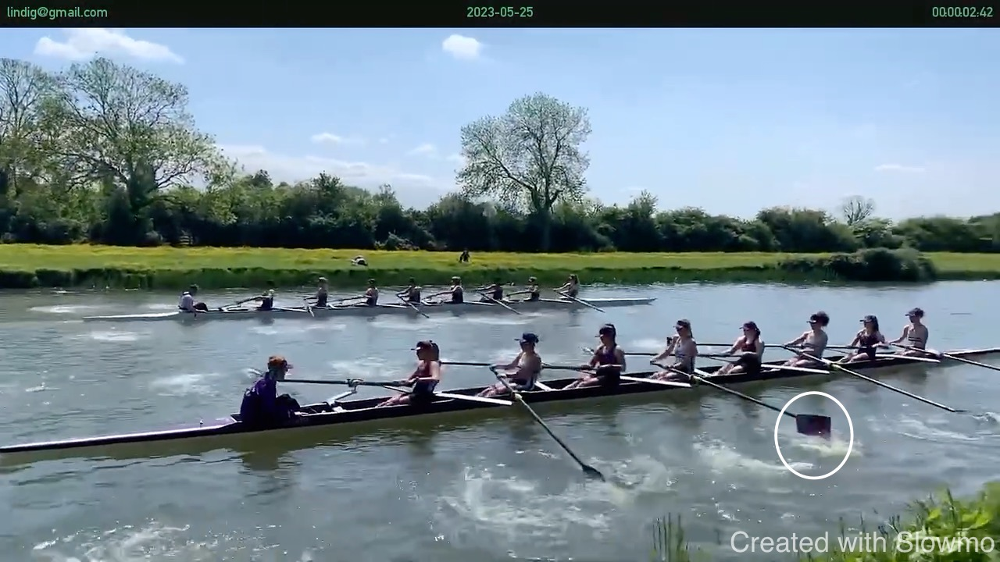
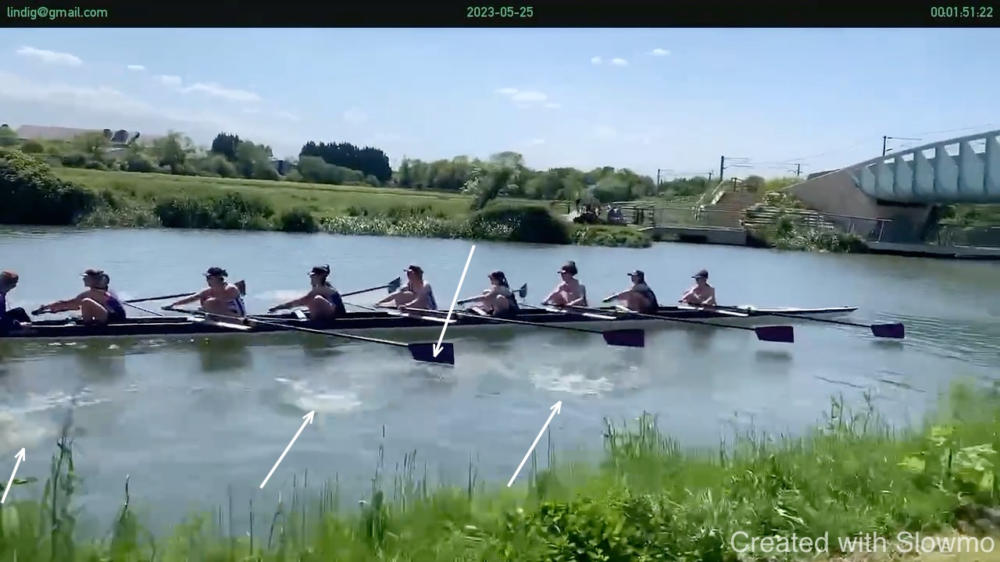
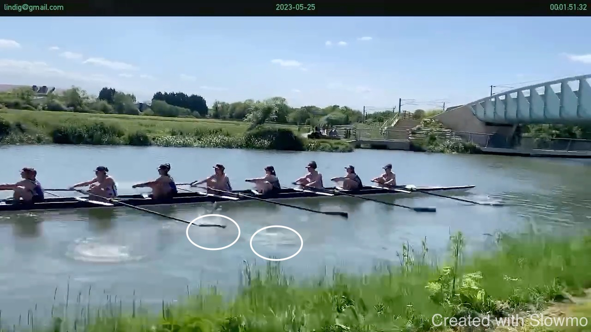

# Kings W1 vs Magdalene W1 at 99s Regatta

<iframe width="560" height="315" src="https://www.youtube.com/embed/t10nyDkkfPk" title="YouTube video player" frameborder="0" allow="accelerometer; autoplay; clipboard-write; encrypted-media; gyroscope; picture-in-picture; web-share" allowfullscreen></iframe>

The quality of the screenshots below is quite poor. I tried to download
the video from YouTube to work with it but the downloaded file does not
work in my software so I had to re-encode it.

## Start

The general sequence of the start is executed:

* Short, leg-driven strokes to get the boat moving
* Winding the stroke rate up - by keeping the stroke short at the finish
  and front-loaded
* Lengthing the stroke once full boat speed is reached, now using a
  hip-drive to emphasis the send of the boat.

Room for improvement:

* On the first stroke: avoiding to rip the water - visible in 7-seat.
  This does not move the boat and leads to timing differences.
* Finishing the stroke, and together - 5-seat finishes early.

Below is the start of one if the fastest boats in the world: the New
Zealand men's eight. Observe that they are calm in the early strokes and
that there is no white water around their blades.

<iframe width="560" height="315" src="https://www.youtube.com/embed/8QOQbYSGab4" title="YouTube video player" frameborder="0" allow="accelerometer; autoplay; clipboard-write; encrypted-media; gyroscope; picture-in-picture; web-share" allowfullscreen></iframe>

Here is more of their rowing:

<iframe width="560" height="315" src="https://www.youtube.com/embed/iRNv__txlXA" title="YouTube video player" frameborder="0" allow="accelerometer; autoplay; clipboard-write; encrypted-media; gyroscope; picture-in-picture; web-share" allowfullscreen></iframe>

## Rate and Cover

Notice that the puddles of bow-seat are not clearing the catch of 7-seat
and the same is true (but less visible) for 2-seat and stroke-seat. This
means that both are catching in dirty water. 

This suggests that the stroke rate is too high for the speed of the
boat. A longer stroke would bring the rate slightly down and the boat
would move farther during the stroke - avoiding the problem. This is
something for the cox to keep in mind.

## Following Stroke

My general impression is that the crew has difficulty following stroke
because stroke is rowing at the highest possible rate (for her). The
role of stroke is to set a rhythm that the boat can follow and that
looks compromised to me. This would be another reason to calm the stroke
down and find more unity and control.

