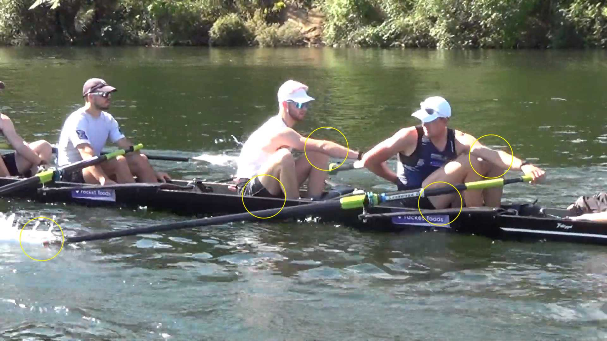

# New Zealand Men's Eight

The New Zealand Men's Eight won Olympic Gold in 2021 in Tokyo and is
coached by Irishman Tony O'Connor who puts interesting videos from their
training work on YouTube.

<iframe width="560" height="315" src="https://www.youtube.com/embed/Zsr2g2ycKjY" title="YouTube video player" frameborder="0" allow="accelerometer; autoplay; clipboard-write; encrypted-media; gyroscope; picture-in-picture" allowfullscreen></iframe>

In the video stern pair are rowing with outside arm only (and later with
both) and it gives a good view into their stroke. I find it interesting
what they do and don't do.

* Every part of the body is relaxed: note the shoulders and the grip in
  particular.

* The lower outside arm draws parallel with the water at the finish. For
  this to work, the outside elbow moves away from the body and the grip
  of the outside hand is loose.

* The recovery has a clear sequence but is relaxed. Knees stay down but
  the elbows are slighly bent; fingers maintain a relaxed grip. All
  motion is fluid.

* The turnaround at the finish: there is no pause or stop, the handle
  moves around neither fast or slow. The speed of the handle in the
  reovery is constant.

* Towards the catch, the outside arm is straight without moving the
  shoulders up.

* Towards the catch (before the turnaround at the front) the blade is
  lowered towards the water and it almost touches the water when the
  seat turns around.

* The catch is taken with the seat: the seat moves back, arms stay
  straight.

* During blade entry at the catch the handle moves towards the rower and
  needs to be accomodated. They don't do: bending the arm or opening the
  back/shoulders to take the catch.

* During the early part of the drive the body stays forward - just the
  seat moves back, before the body comes in. Half slide is when upper
  and lower leg are at a 90 degree angle - at this point the body starts
  opening.

* The blade is just under the surface. Observe that most of the shaft is
  outside the water.

* At the finish the body is still and the arm is drawn into a still
  body.

