# ROB CAM XPR M8+ 2023-05-08

<iframe width="560" height="315" src="https://www.youtube.com/embed/ROtChK-A2IY" title="YouTube video player" frameborder="0" allow="accelerometer; autoplay; clipboard-write; encrypted-media; gyroscope; picture-in-picture; web-share" allowfullscreen></iframe>

## Catch and Connection

Some random observations - I invite your comments. First two frames I'm
looking at the knees at the catch and connection. I am looking for the
blades touching the water when the shins are vertical. I know that we
can compress a bit more but I think the trade off is not worth it: it
risks stalling the seat before the blade touches the water, and thus
slowing down the boat. The next frame looks at the shins when the blades
are in the water and connect.  We are looking to connect early with
little leg drive - this requires looseness to enter quickly and patience
for the connection. These contradicting requirements make the catch
difficult and too much talk about quickness can blur this.

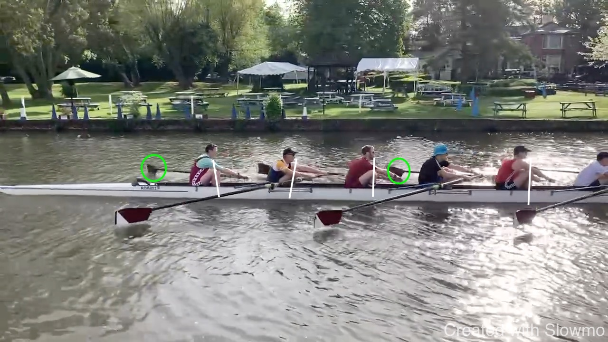
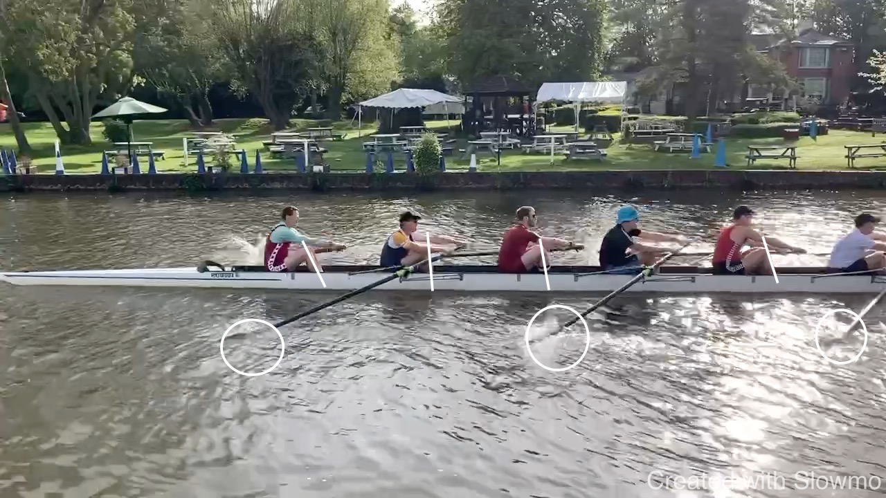
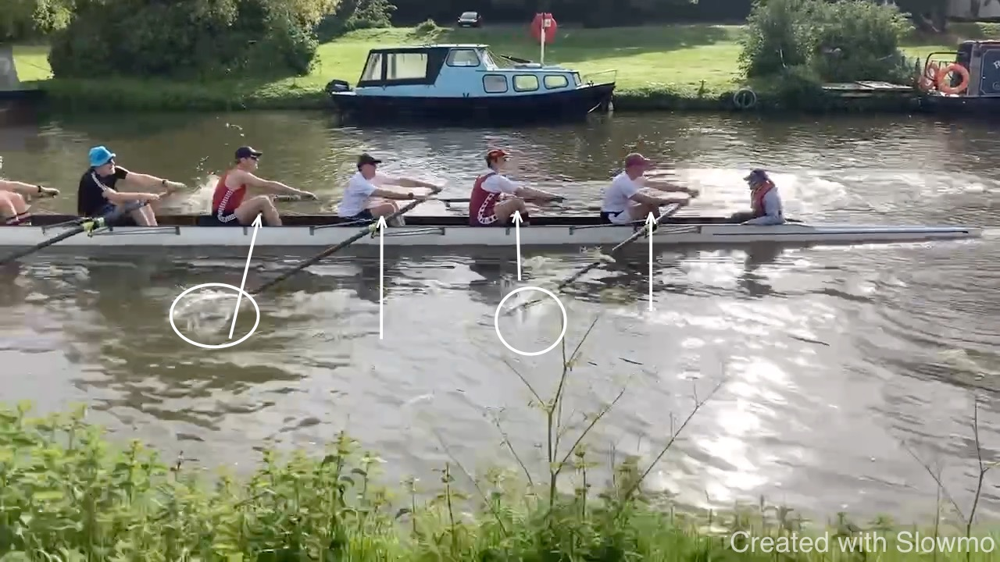

## Outside Arm

Next, a relaxed, straight outside arm in the drive. We want to avoid
working with weak muscles or strong muscles from the legs against weak
muscles in the arms. 

Keeping the arms relaxed is in part an exercise in mental relaxation but
in part a consequence of the sequence. If the body opens early, it is
difficult to avoid using the arm towards the finish. In the early part
of the drive we want to "keep the handle out" - not bringing the handle
towards us but pushing the boat - and letting the handle come to us.

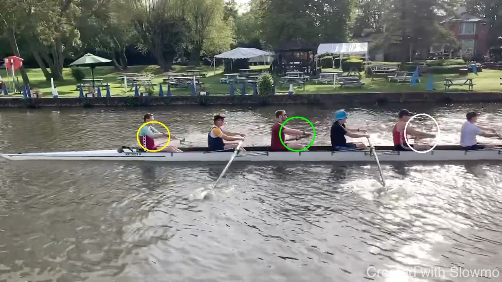
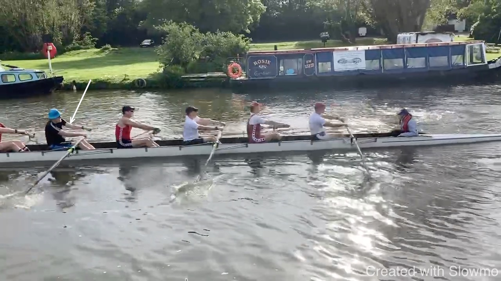

## Rocker Over

We want to rock over the hips: "up and over". This pushes the seat
slightly back. If we don't do this and just bring the shoulders forward,
it is difficult to find the length at the front.

While we rock over, we want to keep the knees down. However, only once the
knees do come up, we can complete the rock over.

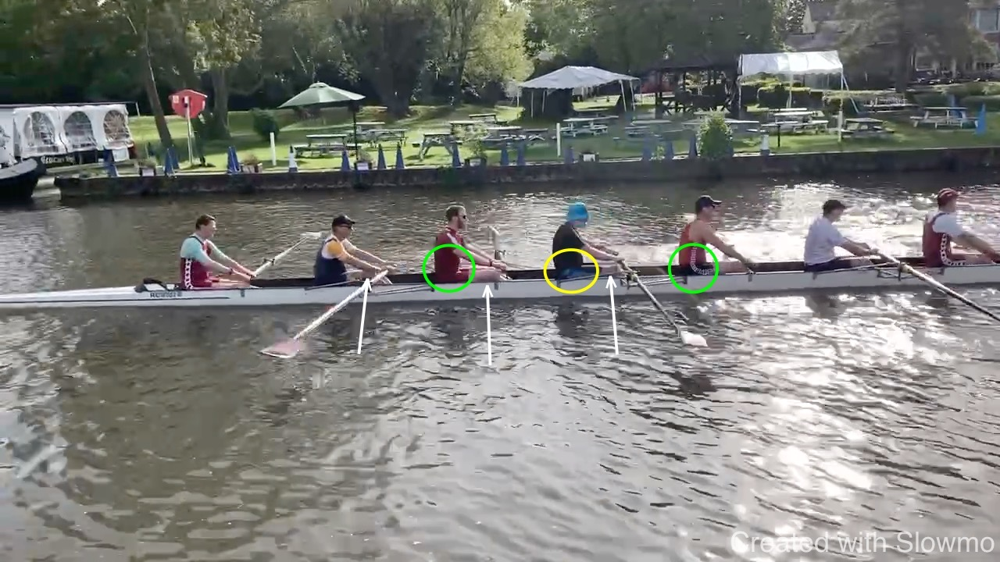
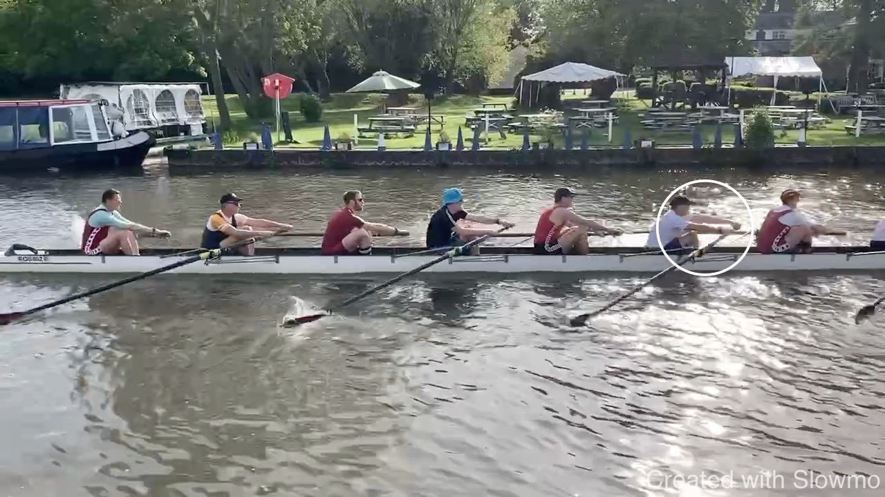

## Hands Away

Stern 4 don't agree about the recovery speed for the hand. I don't think
one style is inherently superior but we need to agree. Again, I believe
shins-vertical is an important point where the blade should be ready to
enter. For this it is important to let the recovery by led by the hand
rather than the seat.

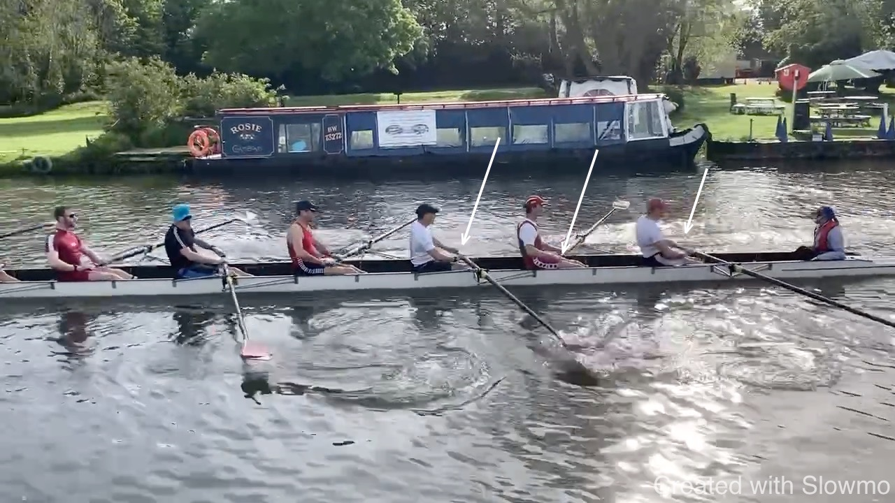
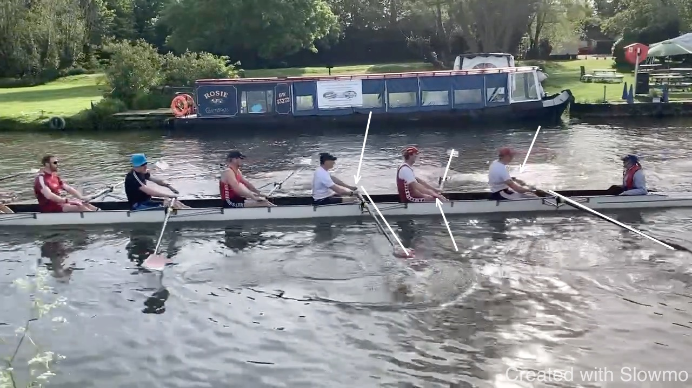
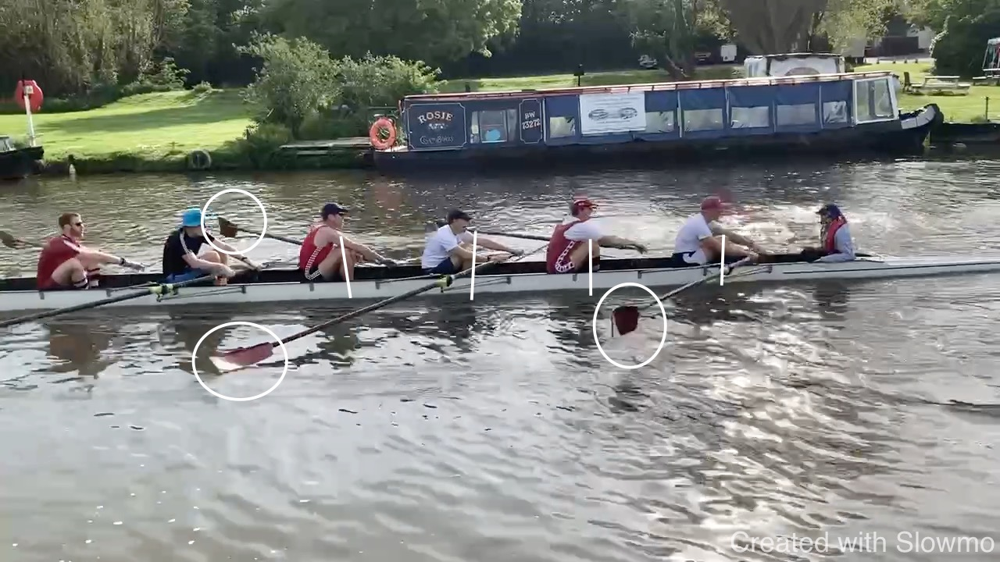
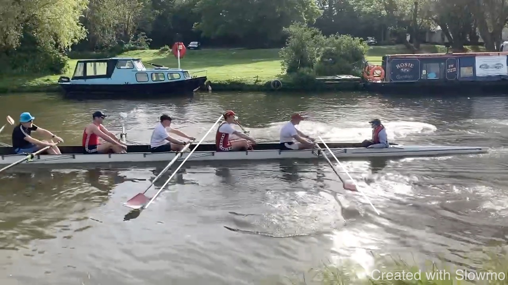

## Release

We want to avoid that the boat stays attached to the blade at the finish
and instead is released. This works well. 

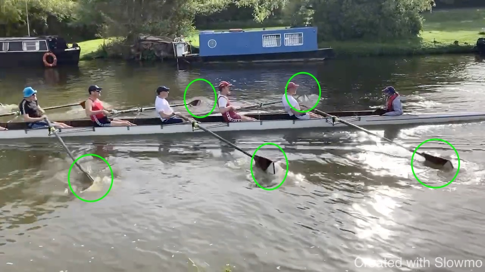

## Catch Timing

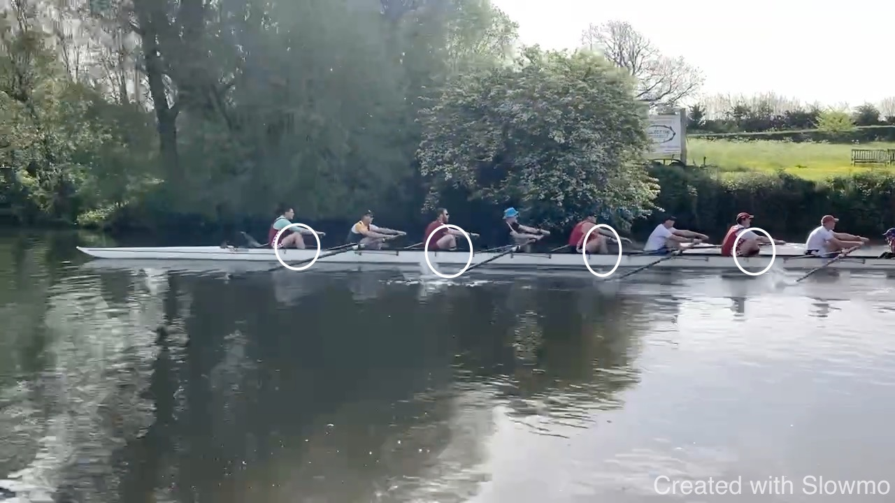
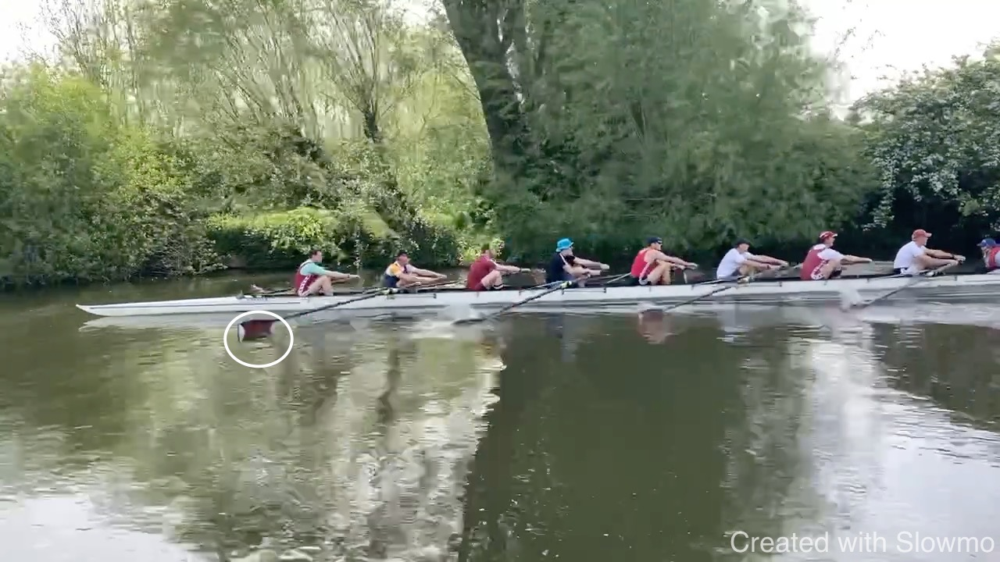

