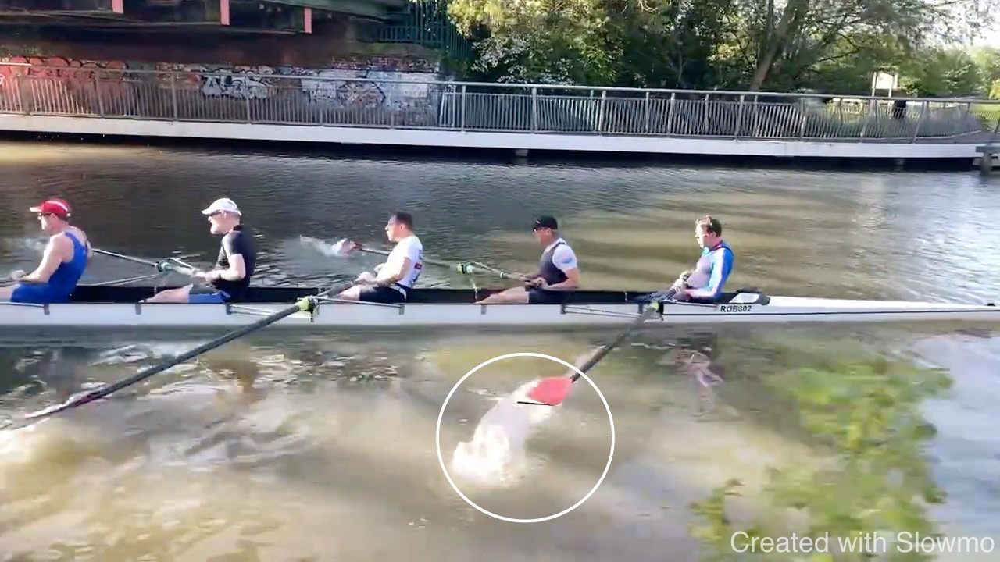

# ROB CAM XPR 2023-05-21

<iframe width="560" height="315" src="https://www.youtube.com/embed/aF-LrwOvPHg" title="YouTube video player" frameborder="0" allow="accelerometer; autoplay; clipboard-write; encrypted-media; gyroscope; picture-in-picture; web-share" allowfullscreen></iframe>

## Individual Comments

### Alex - Finish

For a simple finish, the blade has to clear the water before feathering.
Scooping up water indicates that the blade is feathered in the water.

### Stefan - Late Drive and Finish

The power in the second half of the drive comes off early. We are
looking for a long direct connection. This connection breaks once the
arms bend because we can't repeatedly hold our body weight. Here this
happens before the body is vertical. The feathering motion of the
outside hand could trigger this as this is a complicated movement that I
would look to simplify. To maintain contact with the boat, look at the
speed of your legs. Observe that a lot of leg drive is left when the
arms start to break.

### Seb - simplify early drive

Simplify the early drive by "keepign the handle out": you are brining
the handle to you by working on it. Try to keep it out, just working with
the legs, then opening the body against the feet. This gives you a
longer body swing for the seconds half of the drive.

### Jonathan - patience for the connection

We see bending arms towards the finish. I believe this happens because
the early connection is not solid and hence you move through the early
stroke fast, reaching the finish early. Now that forces you to use your
arms.

### David - patience for the connection

We can't give you a bigger spoon so you need more patience for the
connection as you are ripping trough the water. This is something the
entire boat needs to improve. A better connection will improve the
timing in the drive.

### Chris, Guy, Andrea - over-compressing

I believe we should time the catch with the shins vertical to be in a
strong position and to pick up the boat without moving all weight into
the front. Generally fast, solid connection at the front - which gives you a
long strong. "Keeping the handle out" applies here as well - the work
moves to the shoulders early, leading to a body opening. 

### Guy, stern 4 - patience for the connection

A lot of white water around the blades suggets an early power
application; this drives back the boat and shortens the effective stroke
length. I believe this stroke characteristic should change.

### Andrea - posture

## Preparation

Over-compression leads to late preparation: if we aim to catch the boat
in a strong stable postion when shins are vertical, blades need to be
square a tick arlier.

## Start

In the frames below the arrow is from the same point in the background
and hence lets us observe how far the boat has moved.

The first stroke moves the boat one seat - about 1.5m. But one stroke
moves the boat about 3m - so a good part of the stroke the boat didn't
move at all. As can be seen from the blades ripping through the water.
This needs more patience.

Below is a great start.

<iframe width="560" height="315" src="https://www.youtube.com/embed/8QOQbYSGab4" title="YouTube video player" frameborder="0" allow="accelerometer; autoplay; clipboard-write; encrypted-media; gyroscope; picture-in-picture; web-share" allowfullscreen></iframe>

## Stroke in General

Believe the acceleration through the stroke can improve: connecting with
more patience, not as hard, and accelerating the boat for longer.

<iframe width="560" height="315" src="https://www.youtube.com/embed/iRNv__txlXA" title="YouTube video player" frameborder="0" allow="accelerometer; autoplay; clipboard-write; encrypted-media; gyroscope; picture-in-picture; web-share" allowfullscreen></iframe>
