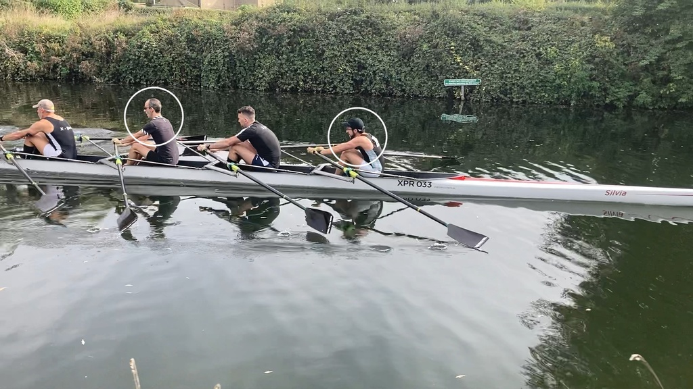
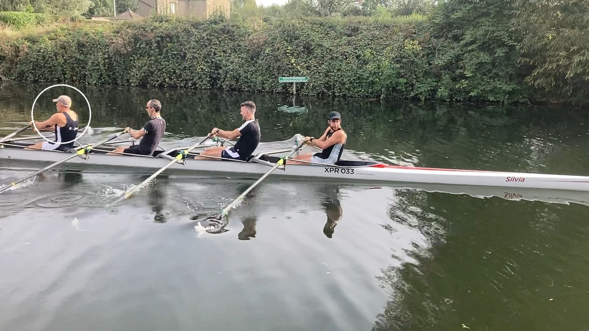
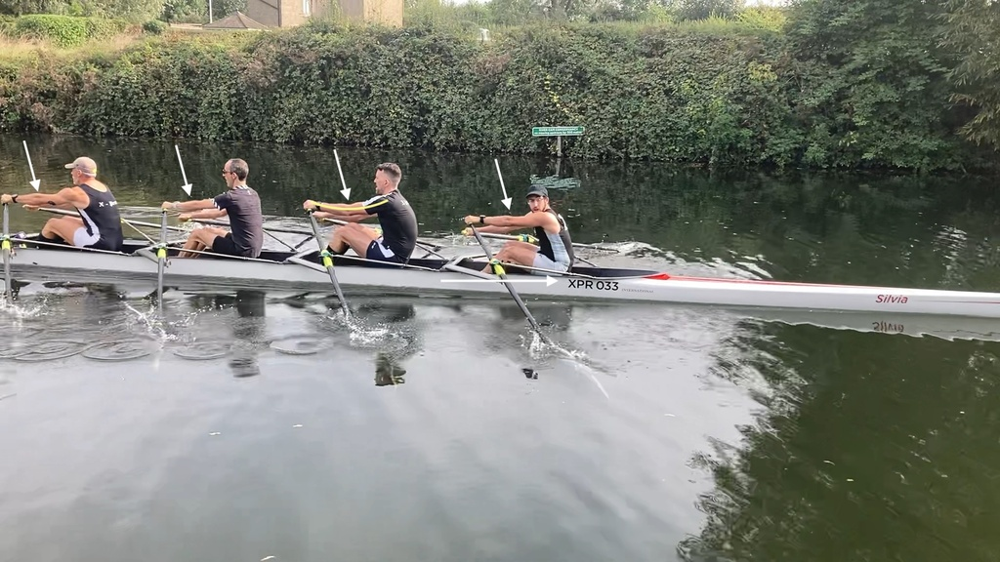
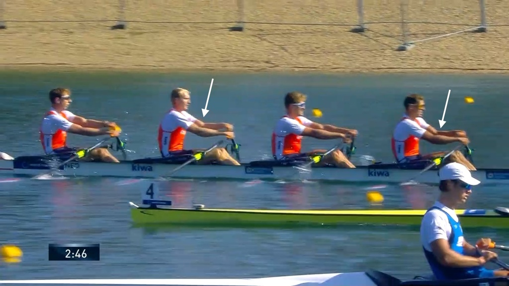
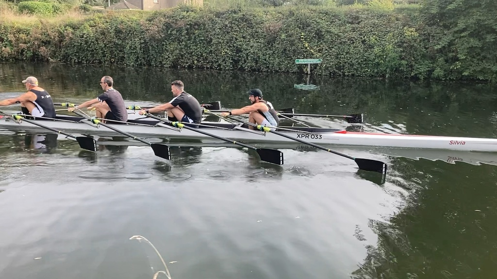
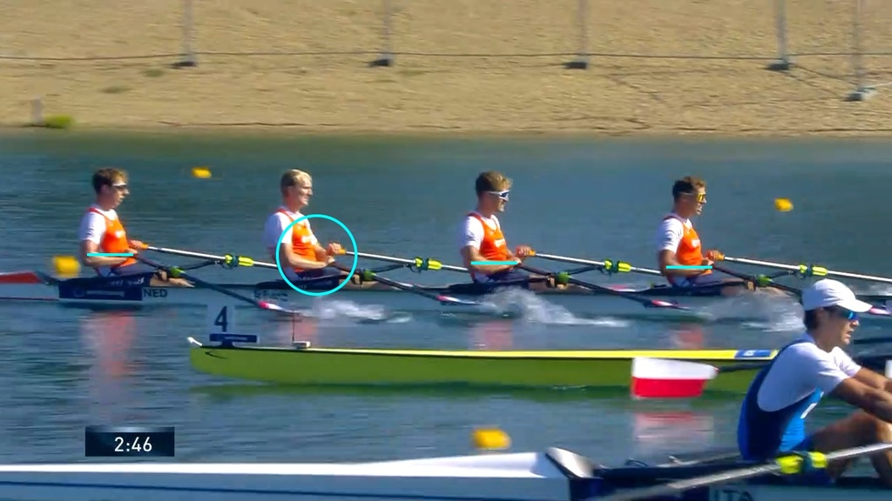

# XPR Masters 4x at Cambridge Small Boat Head 2023-10-07

Some observations from a small piece of video that I took.

<iframe width="560" height="315" src="https://www.youtube.com/embed/rUnkEIXMDSI?si=spJY8-GkqbH__fwf" title="YouTube video player" frameborder="0" allow="accelerometer; autoplay; clipboard-write; encrypted-media; gyroscope; picture-in-picture; web-share" allowfullscreen></iframe>

## Results

* https://www.webscorer.com/race?pid=1&raceid=331290
* 213, XPR-Quattro di copia, Div 2,  O.MasC-G.4x-, 10:23.4 (adjusted)
* 10:39.4 finish time unadjusted 
* Head Wind: https://www.cl.cam.ac.uk/weather/daily-graph?2023-10-07

## Shoulders

Compare the shoulders of Ben and Fernando during the drive and the
finish:

* Ben's sholders look the same in both positions
* Fernando's shoulders come up in the drive

It it slightly present in Andreas's shoulders, too:

Compare against the Dutch 4x (maybe the best 4x in the world right now):

Why do we want shoulders to stay low? The muscle in the back that
connects the hip with the arms is 

* [Latissimus dorsi](https://en.wikipedia.org/wiki/Latissimus_dorsi_muscle)

and it works best when it stays flat. This is compromised when the
shoulders come up. To avoid that happening it is important to engage it
early - an engaged muscle prevent the shouldes from coming up. Think
about keeping the elbows heavy or pulling the elbows slightly forward to
make that happen.

## Arms

Engaging the lats interacts slighly with the arms in the drive. We want
to keep arms relaxed to avoid pulling with the arms using small arm
muscles. The interaction is the reason many good rowers have a slighly
bent arm - which is fine, as long as the situation is static and the
small muscles are not used.

I suspect that Henrique is slighly pulling with the arms - which is
tiring. We rather want to keep handles out and try to become lighter on
the seat without conracting the arms. Compare with Andrea and Ben.

## Postion at the Catch

We want to sit tall at the catch such that we can lift from the seat
when we are connected. Likewise, we don't want any weight on the
handles: if we lean onto the handles for stability, chances are the
blade entry is slow and the body will open when the load comes on, to
regain stability. Hence, we can only bring the body weight forward where
we are still stable on the seat. I believe Henrique has a tendency to do
that - but his so tall and has so much wing span that he doesn't need to
- length is gained from opening the arms. Compare body positions at the
  catch with the Dutch crew.

## Finish

Observe the position of elbows (same height as hands) and hands (fairly flat)
of the Dutch crew.

