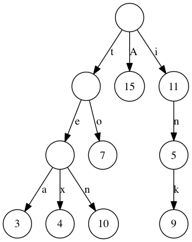

# General Questions

1. Given a large collection of N integers, find the largest two.

2. Now find the largest five?

3. How can this be tested?

4. What is the computational complexity?

5. What is the best approach given the complexity?

6. What about maintainability of the code?

# Functional Programming

Below are some programming exercises that we ask you to complete in a
typed functional language like OCaml, Haskell, or Scala.

## Function f

```
(* OCaml *)
let rec f x =
  match x with
  | []   -> 0
  | h::t -> 1 + f t

-- Haskell
f []    = 0
f (h:t) = 1 + f t

```

1. What does `f` do?
2. What is the type of `f`?
3. Is `f` polymorphic? Why or why not and what does that mean?

## Function `explode`

Write a function `val explode: string -> char list` that takes a string
and returns the string's characters as a list of characters (in the
order of the string).  Potentially useful functions from the OCaml
language and standard library:

* In OCaml, characters in a string can be accessed like in `"hello".[0]`.
  The value of this expression is character `'h'`.
* `String.fold_left : ('a -> char -> 'a) -> 'a -> string -> 'a`.
  `fold_left f x s` computes `f (... (f (f x s.[0]) s.[1]) ...) s.[n-1]`,
  where `n` is the length of the string `s`.
* `List.init : int -> (int -> 'a) -> 'a list`
  `init len f` is `[f 0; f 1; ...; f (len-1)]`

## Function `scan`

Given a string, compute all sub strings starting with `a` and
ending with `b` and with no other `a` or `b` between `a` and `b`. The
following examples are legal such sub strings: `ab`, `accb` but this
would not be a such a sub string: `acabb`.

1. Is there another way to characterise the sub strings we are looking
   for?

2. What algorithmic complexity can we expect for `scan`?

3. Can you suggest two approaches to implement this and pick one?

4. How would you test this?

## A Trie Map

Implement a map from strings to integers using a trie.

        "A"   ->  15
        "to"  ->   7
        "tea" ->   3
        "tex" ->   4
        "ten" ->  10
        "i"   ->  11
        "in"  ->   5
        "ink" ->   9



1. Define an interface
2. Implement the interface
3. How can this be tested?

## Error Handling

What error handling techniques in functional programming are you
familiar with? Discuss their relative advantages.

## Polymorphism

How is polymorphism understood in object-oriented languages and
functional languages? Is this understanding essentially the same or is
there a difference?


